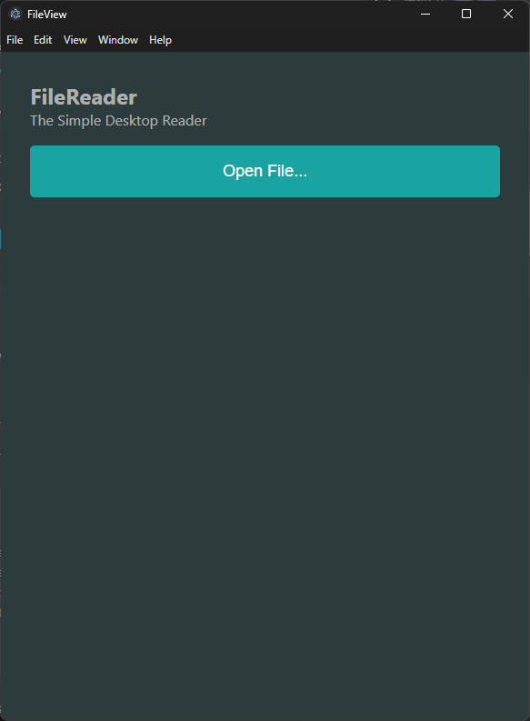
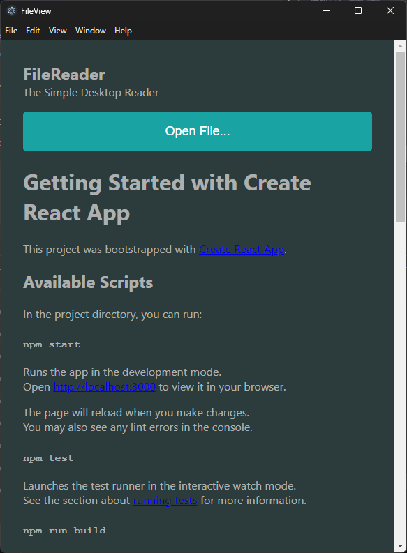

# FileViewer

A simple desktop reading application.

## What does it do?

Currently, it opens markdown files (.md) for viewing. Wanted to create a reader
that doesn't require me opening VSCode and performing a preview.

It's _really really really_ barebones. May consider adding the ability to read
other types of files, and adding a library for easy access to your recently
opened files.

### Some preview pictures

How the app looks upon opening

How the app looks when reading a document

